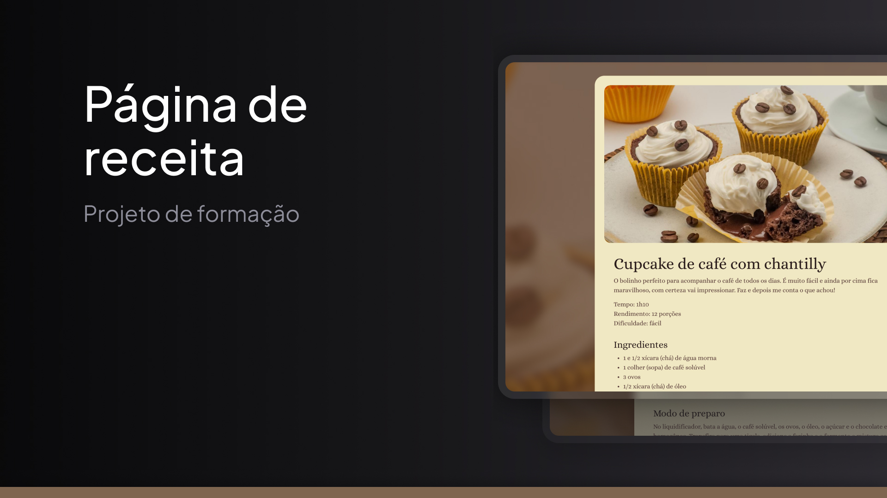

# Página de Receitas - Projeto de Formação

Este repositório contém um projeto desenvolvido como parte do curso de **Fullstack** da **Rocketseat**. Trata-se de uma página web simples e estilizada que apresenta uma receita, utilizando **HTML** e **CSS**.

<p align="center">
  
</p>

## 📋 Sobre o Projeto

A página foi criada com o objetivo de aplicar e praticar os fundamentos de desenvolvimento web, incluindo:

- Estruturação de conteúdo com **HTML**.
- Estilização visual com **CSS**.
- Uso de boas práticas de organização de código.

## 🖥️ Tecnologias Utilizadas

- **HTML5**
- **CSS3**

## 📝 Funcionalidades

- Exibição de uma receita com descrição clara e detalhada.
- Estilização responsiva e atraente para melhorar a experiência do usuário.
- Layout simples e intuitivo.

## 🚀 Como Executar o Projeto

1. **Faça o clone do repositório**:

    ```bash
    git clone https://github.com/seu-usuario/nome-do-repositorio.git

2. **Navegue até a pasta do projeto**:
    ```bash
    cd nome-do-repositorio

2. **Abra o arquivo index.html em qualquer navegador web**.


## 📂 Estrutura de Arquivos
```plaintext
nome-do-repositorio/
├── assets/          # Imagens e outros recursos estáticos
├── index.html       # Estrutura principal da página
├── styles.css       # Arquivo de estilização
└── README.md        # Documentação do projeto```
```

## 🌟 O que Aprendi

- Como organizar um arquivo **HTML** para melhorar a legibilidade.
- Aplicar estilos com **CSS** para tornar uma página visualmente agradável.
- Práticas básicas de estruturação de projetos web.

## 🤝 Contribuição

Contribuições, issues e sugestões são sempre bem-vindas! Sinta-se à vontade para criar um fork e enviar um pull request.
