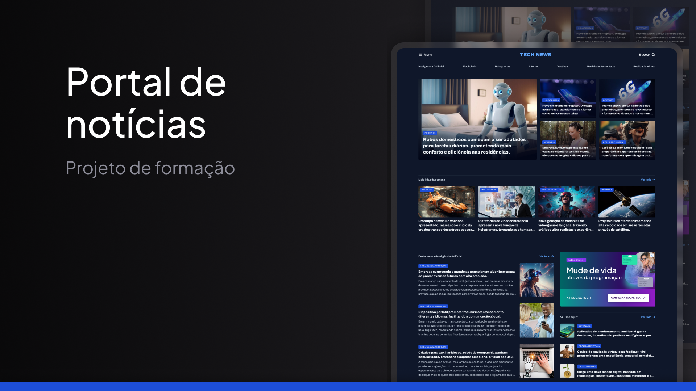

# Portal de Notícias 📰 - Projeto de Formação

Este repositório contém um projeto desenvolvido como parte do curso de Fullstack da **Rocketseat**.
O **Portal de Notícias** é uma página estática que simula um site de notícias, com foco em layout responsivo e design moderno. O objetivo principal deste projeto é consolidar o aprendizado de HTML5 e CSS3, aplicando boas práticas de estruturação semântica e estilização avançada.

<p align="center">
  
</p>

## 📋 Sobre o Projeto

O Portal de Notícias é uma aplicação estática que simula a interface de um site de notícias, com seções organizadas para exibir manchetes, artigos, anúncios e uma barra de navegação intuitiva. O projeto inclui:

- Cabeçalho com logo e barra de navegação.
- Seção de manchetes com notícias em destaque.
- Artigos organizados em uma grade responsiva.
- Anúncios integrados ao layout.
- Rodapé com informações adicionais e links.

A página é totalmente estática, construída com HTML e CSS, e serve como um exemplo de design responsivo e moderno.

## 🖥️ Tecnologias Utilizadas

- **HTML5**: Estruturação do conteúdo da página.
- **CSS3**: Estilização e design responsivo.

## 📸 Visão Geral do Design

O design do Portal de Notícias é clean e organizado, com foco na legibilidade e na experiência do usuário. A interface é projetada para destacar as manchetes e artigos, mantendo uma navegação simples e intuitiva. O layout se adapta a diferentes tamanhos de tela, garantindo uma boa experiência tanto em dispositivos móveis quanto em desktops.

## 🚀 Como Executar o Projeto

1. **Faça o clone do repositório**:

    ```bash
    git clone https://github.com/seu-usuario/projeto-portal-noticias.git

2. **Navegue até a pasta do projeto**:
    ```bash
    cd projeto-portal-noticias

2. **Abra o arquivo index.html em qualquer navegador web**.


## 📂 Estrutura de Arquivos
```plaintext
projecto-portal-noticias/
│
├── assets/             # Pasta para imagens e ícones
│   ├── icons/          # Ícones SVG utilizados no projeto
│   └── Images/         # Imagens (logo, anúncios, thumbnails)
│
├── styles/             # Pasta para arquivos CSS
│   ├── global.css      # Estilos globais
│   ├── header.css      # Estilos para o cabeçalho
│   ├── index.css       # Estilos específicos para a página principal
│   ├── sections.css    # Estilos para as seções de notícias
│   └── utility.css     # Classes utilitárias para reutilização de estilos
│
└── index.html          # Página principal do portal
```

## 🌟 O que Aprendi

- **Organização de Código**: Aprendi a estruturar e organizar arquivos HTML e CSS de forma modular, separando estilos específicos para diferentes seções da página (como cabeçalho, artigos e rodapé).
- **Design Responsivo**: Pratiquei a criação de layouts responsivos que se adaptam a diferentes tamanhos de tela, garantindo uma boa experiência de usuário em dispositivos móveis e desktops.
- **Boas Práticas de CSS**: Apliquei conceitos como reutilização de classes, uso de variáveis CSS e organização de estilos em arquivos separados para facilitar a manutenção e escalabilidade do projeto.

## 🤝 Contribuição

Este projeto foi criado como um exercício de HTML e CSS, mas se você quiser contribuir ou sugerir melhorias, sinta-se à vontade para fazer um fork e enviar um Pull Request.
